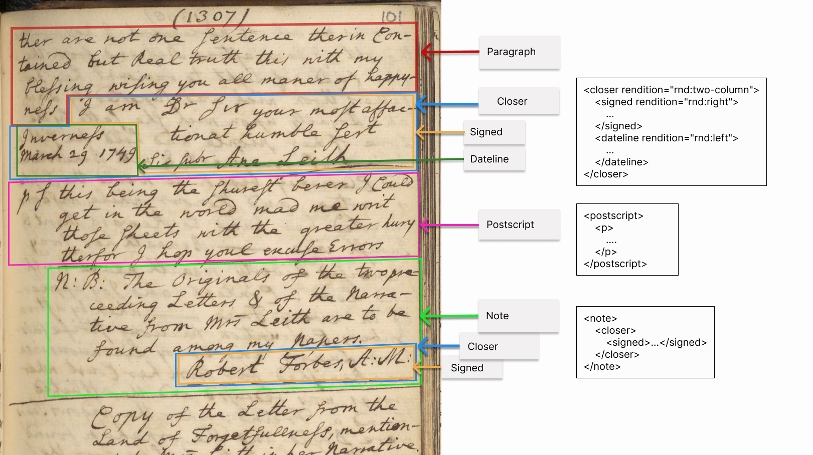

# Document Structure

## Headings

Headings appear at the beginning of an item, usually giving a title ascribed by Forbes. Not all items have headings—most do, but there are notable exceptions, especially in the later volumes of the manuscript. 

To encode the heading of a document, use the `<head>` element:

```
 <head>Copy of a Letter to Mr
    <lb/>Robert Forbes at My Lady
    <lb/>Bruce's Lodgings at Leith.
 </head>

```

Since headings appear inconsistently across the document collection and are often styled differently, any renditional information about the heading (i.e. size or alignment) must be specified using the `@rendition` attribute. For instance, consider the heading for "Copy of a Letter to Mr Robert Forbes at My Lady Bruce's Lodgings at Leith":


The heading here is both in larger writing and aligned to the right, which we can describe by using the "rnd:right" and "rnd:large" values on `@rendition`:

```
 <head rendition="rnd:right rnd:large">Copy of a Letter to Mr
    <lb/>Robert Forbes at My Lady
    <lb/>Bruce's Lodgings at Leith.
 </head>
```

## Paragraphs


## Openers and Closers

Openers and closers refer to material that tend to begin or conclude a letter.

```{=tei}
<specList>
	<specDesc key="opener"/>
	<specDesc key="closer"/>
    <specDesc key="salute"/>	
    <specDesc key="dateline"/>
    <specDesc key="postscript"/>    
</specList>
```

Letters often conclude with various features that we want to tag, including closers with signatures and datelines; postscripts; and trailing notes written by Forbes. 



The above would be encoded like so:

```
 <p> 
    <!-- [Paragraph begins on the previous page] -->
      <lb/><choice><orig>ther</orig><reg>there</reg></choice> are not one sentence therein <w>Con<pc force="weak">-</pc>
	<lb/>tained</w> but Real truth this with my
	<lb/>blessing <choice><orig>wising</orig><reg>wishing</reg></choice> you all <choice><orig>maner</orig><reg>manner</reg></choice> of <choice><orig><w>happy<pc force="weak">-</pc>
	<lb/>ness</w></orig><reg>happiness</reg></choice> 
</p>
<closer rendition="rnd:two-column">
    <signed rendition="rnd:right">I am <choice><abbr>Dr</abbr><expan>Dear</expan></choice> Sir your most <choice><orig><w>affac<pc force="weak">-</pc>
        <lb/>tionat</w></orig><reg>affectionate</reg></choice> humble <choice><abbr>sert</abbr><expan>servant</expan></choice>
        <lb/>Sic subr <persName ref="prs:LEITA1"><choice><orig>Ane</orig><reg>Anne</reg></choice> Leith</persName>
    </signed>
    <dateline rendition="rnd:left"><placeName ref="plc:INVE2">Inverness</placeName>  
    <lb/>March 29 1749</dateline>
</closer>
<milestone rendition="rnd:right" type="rule" unit="section"/>
<postscript>
    <p>p s this being the <choice><orig>shurest</orig><reg>surest</reg></choice> <choice><orig>berer</orig><reg>bearer</reg></choice> I Could
    <lb/>get in the world <choice><orig>mad</orig><reg>made</reg></choice> me write
    <lb/>those sheets with the greater <choice><orig>hury</orig><reg>hurry</reg></choice>
    <lb/><choice><orig>therefor</orig><reg>therefore</reg></choice> I <choice><orig>hop</orig><reg>hope</reg></choice> <choice><orig>youl</orig><reg>you'll</reg></choice> excuse Errors
    </p>
</postscript>
<milestone unit="section" type="rule"></milestone>
<note type="lim" place="bottom" anchored="false">N: B: The Originals of the two <w>pre<pc force="weak">-</pc>
    <lb/>ceeding</w> Letters &amp; of the <w>Narra<pc force="weak">-</pc>
    <lb/>tive</w> from <persName ref="prs:LEITA1">Mrs Leith</persName> are to be
    <lb/>found among my Papers.</note>
    <closer>
        <signed rendition="rnd:right rnd:large rnd:bordered-bottom-dashed">Robert Forbes, A:M:</signed>
    </closer>
```

### Two Column Closers

Closers often feature a two-column structure (as above) where the `<dateline>` is floated to the left and the `<signed>` is to the right. To encode the two column layout, set the `@rendition` of the `<closer>` to `rnd:two-column` and then use `rnd:left` for the block floated to the left and `rnd:right` for the block floated to the right. For instance, the above 

## Verse

Poems and other verse fragments should be encoded using the following elements for verse:

```{=tei}
<specList>
	<specDesc key="l"/>
	<specDesc key="lg"/>
</specList>
```

All `<l>` elements should be enclosed within an `<lg>`; note that you do need to include a line beginning element for verse lines.

For poems with headings, use the `<head>` element inside of the `<lg>`

```
<lg>
    <head rendition="rnd:center">1.</head>
    <l>As the Devil was walking o’er Britain’s fair Isle,</l>
    <l>George spied in his Phiz a particular Smile,</l>
    <!--[...]-->
</lg>
```

Indented lines should be encoded using `@rendition` with the value "rnd:indent".


