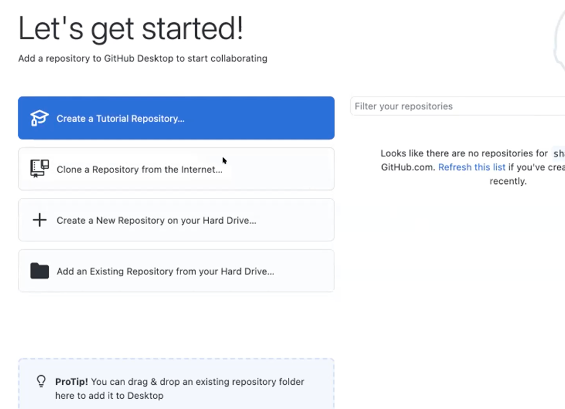
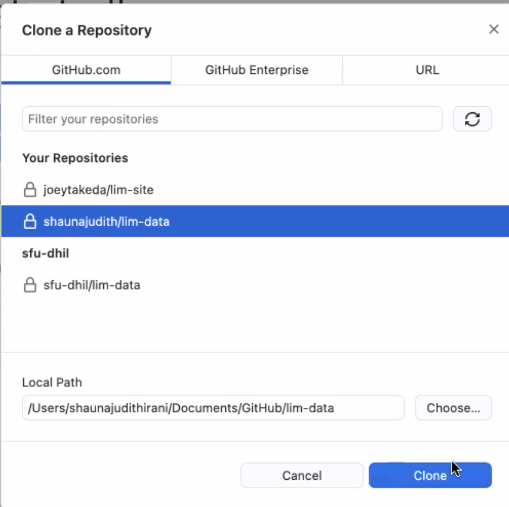

# Getting Started

## Setting up

Before working on the LiM documents, there are two pieces of software you will need to install: oXygen XML Editor and Github Desktop. You will also need a Github account.

* Provide the DHIL with your GitHub account username. If you do not have a GitHub account, you can create a free account here: [https://github.com/join](https://github.com/join).
* Download and install oXygen:[https://www.oxygenxml.com/xml_editor/download_oxygenxml_editor.html](https://www.oxygenxml.com/xml_editor/download_oxygenxml_editor.html). Members of the LiM team should contact the DHIL regarding license keys.
* Download and install the GitHub desktop client: [https://desktop.github.com/](https://desktop.github.com/)

### Setting up the Repository

The main data repository for the project is `lim-data`. At the moment, this is a private repository, which means you must first be invited as a contributor. Once you've made your GitHub account, let an administrator from the DHIL know your GitHub username and they will invite you to join the repository; note that this invitation may take up to an hour to wend its way through the email system (especially if you are using your SFU email). Once you receive that email, make sure to accept the invitation for the lim-data repository.

For the LiM project, we use a "fork" workflow. This means that, rather than contributing directly to the main repository, each team member maintains a local copy of the files that are then pushed up to the main repository. To create your own fork, do the following:

Create a fork repository on GitHub website. Log in to your ID and click on “Fork”. 

Open GitHub Desktop.

Click on “Clone a Repository from the Internet”. 

Ensure that the page is refreshed. Then, click on your repository (eg. shaunajudith/lim-data), select a local path of your choice (eg. Desktop), and then click on “Clone”. 

A pop up may appear asking “How are you planning to use this fork?”. Select “To contribute to the parent project” and click “Continue”. 

Open Oxygen XML Editor. Click on “sample.xpr” and then “Open Project".

Open the lim-data folder created earlier, select “lim.data.xpr” and click “Open”. A pop-up will ask you to confirm your selection, click “Yes”. 

Go to the top panel, click on “Oxygen XML Editor” and select “Preferences”. 

In the “Type filter text” box, type in the word “wrap”. Then, under “text”, check the box next to “Line wrap”.
'

