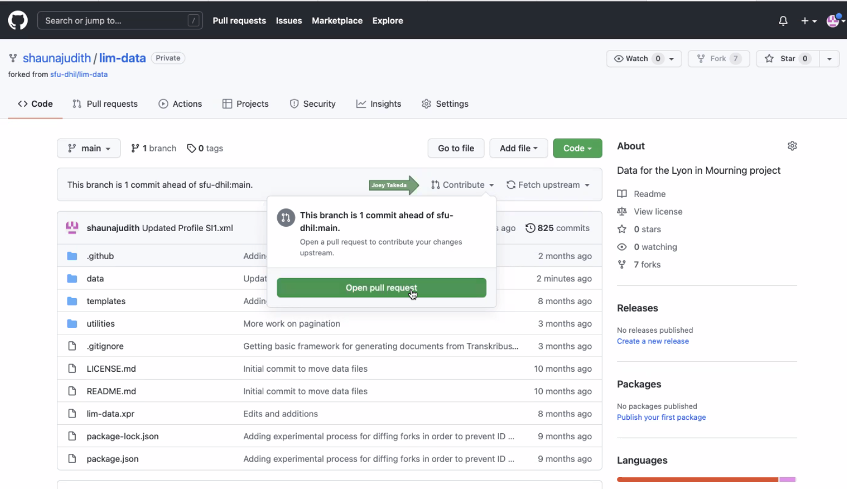

# Workflow

All of the documents for the LiM project are kept in GitHub, which is a version control software system (much like Google Drive). There are a number of advantages of using this approach, but, at its core, what this means is that every version of a file is archived; at any point, we can "roll back" the repository if we need to for whatever reason.

In this project, we following a workflow called "forking":

* Each contributor creates their own repository in their GitHub account by "forking" the main (or "upstream") repository
* Each contributor then downloads their version of the repository (or the "origin" repository) and then makes changes on their computer ("local")
* While a contributor is working on a task, they save their local changes and push them back to their version of the repository (the "origin")
* Once they are ready for everyone else to see their changes, they do a "pull request" so that the upstream repository reflects their changes

You can consider the upstream repository like an article that is going through publication; each editor takes a photocopy of the article and makes changes. When each editor has finished making their changes, they send it back to the publisher (here, sfu-dhil). When the article needs to go through the next round of revisions, the publisher sends out a new version of the article with your and everyone else's changes combined, and the editing process starts again.

There are three main steps to this workflow:

1. "Pulling" from the upstream repository to update your fork (i.e. getting the most up-to-date version of the data)
2. Commit and saving your work ("pushing" to the "origin" repository)
2. Contributing your work back to the upstream repository (by issuing a "pull request") 

## Updating your Repository

Update your local copy of the repository by merging any changes from the upstream repository. To do so:

* Open GitHub Desktop and click the branch tab (the second tab on the top; it will say something like "main"): 

* In the branch menu, click Choose branch to merge into **main**: 

* Click on "upstream/main": 

* Depending on whether your repository is up to date: 
	* If there are no changes to merge (This branch is up to date ...), then you're done!

	* If there are changes to merge (This will merge x commits...), then click Merge upstream/main

## Editing in oXygen

All work on the TEI documents should be done in oXygen. It is an incredibly powerful and useful tool for editing XML and there are a number of custom features and tools that will editing easier and more efficient.

When you open oXygen, make sure you see the `lim-data.xpr` project in the oXygen project pane (usually on the left-hand side): 

oXygen remembers the last project you opened, so it will usually use the `lim-data` project file automatically. If, for whatever reason, you are not in the `lim-data` project, make sure to open the project file by going to `Project/Open Project` in the toolbar. You can use the Project pane to navigate through the project files; all of the TEI files are in the `data/` folder.

As you edit your TEI file in oXygen, it is imperative that you frequently and consistently validate your file. Invalidities in an oXygen are signalled much like spell-check: the invalid element is underlined in red and its location in the document is marked in the scrollbar.

oXygen validates for you automatically as you type, but it might lag (especially for large or complex documents), so it is best practice to trigger validation manually as well, especially before committing your changes.

To validate your document, you can either use the keyboard shortcut CMD+Shift+V (CMD = ⌘ on Mac) or click the red checkmark in the toolbar:

Once the document finishes validating, there will be a message at the bottom of the screen stating whether validation was successful. If there are errors in your document and validation fails, you will see the red underlines and a info box at the bottom of the screen that outlines the precise errors.  

Try your best to determine what the error is: the validation message usually provides a good indication of what the pfrom the validation message (some are more helpful than others); the problem is quite often something simple like a typo, an errant space at the beginning or end of an element, or a missing quotation mark.

If you can't figure out the error, then it is OK to commit the file, but do let the team and the developers know right away so that the error can be resolved as soon as possible.

## Committing Changes

After you've made a set of changes (i.e. before you take a break or before the end of your work day) and confirmed that they were valid, you need to commit those changes to the repository. To do that, navigate to GitHub Desktop, which should show you a list of changes that you've made: 

It is a good idea to review those changes to make sure everything looks right (i.e. all of the files that you actually changed are listed; there are no additional changes). (You may see that the `lim-data.xpr` oXygen project file has changed even though you didn't do anything to it—that's expected).

Assuming that everything looks correct, you can then commit those files by filling out the commit message boxes in the bottom left-hand corner: 

These commit messages are helpful for record keeping and for tracking changes to the files; note that these commit messages are both permanent and public. In the `Summary` field, add a brief description of what you've done (i.e. "Added index items for vol7"). If there is additional information you'd like to add, put a longer explanation in the `Description` box.

## Issuing a Pull Request

When you are ready for the changes to be reflected on the website, you need to contribute to the main repository. Click on “contribute” and then “Open pull request”. 

Review your changes and click on “Create pull request”. 

A new window will open. Add a title and a comment to provide an update about the work. Click on “create a pull request” button to confirm. The administrator will review and accept this request. 

